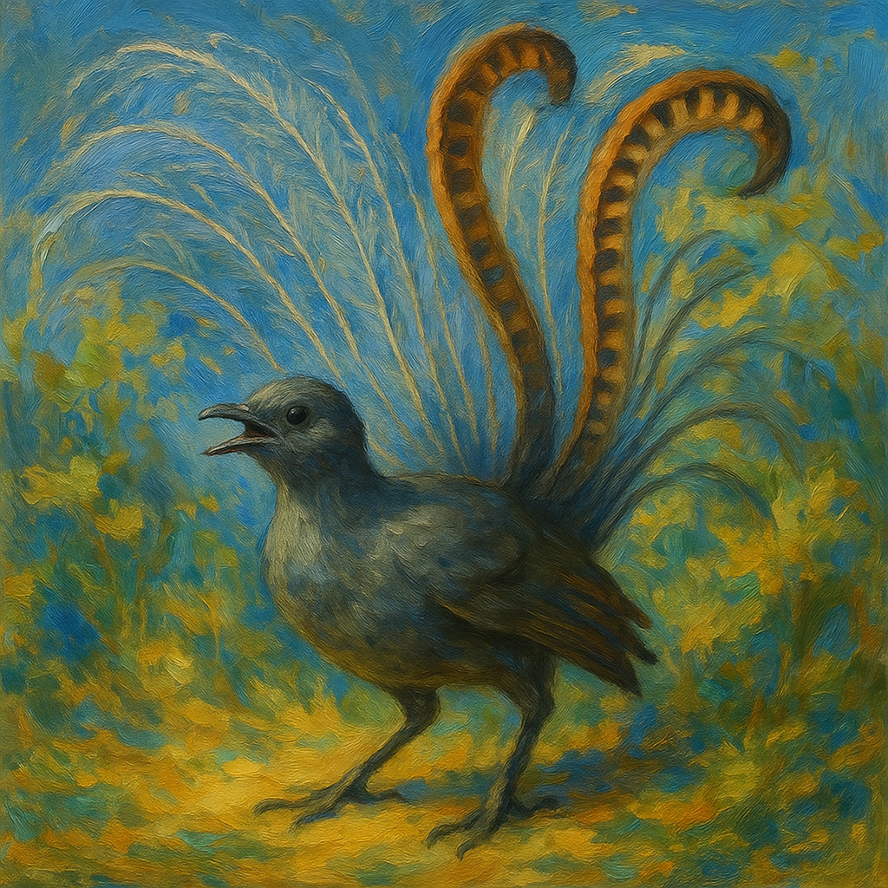

# Lyrebird: 3D Conformer Generation

<p align="center">

</p>

This repository contains the **Lyrebird** neural network for 3D conformer generation, developed by Rowan based on the [ETFlow](https://arxiv.org/abs/2410.22388v1) architecture. You can use the pretrained model weights locally or run predictions directly via the [Rowan web platform](https://labs.rowansci.com/).

For questions or issues, please open a GitHub issue or contact the Rowan team at contact@rowansci.com.

## Overview

Lyrebird is trained on diverse molecular geometries and generates 3D molecular conformers from SMILES strings using an equivariant flow-based generative model.
## Example Usage

```python
import torch
from lyrebird import LyrebirdCalculator

# Initialize the calculator
device = torch.device("cuda" if torch.cuda.is_available() else "cpu")
calculator = LyrebirdCalculator("lyrebird.yaml", "lyrebird.ckpt", device=device)

# Generate conformers from SMILES
smiles = "CC(C)CC1=CC=C(C=C1)C(C)C(=O)O"  # ibuprofen
conformers = calculator.predict(smiles, num_initial_confs=5)

print(f"Generated {len(conformers)} conformers")
print(f"First conformer shape: {conformers[0].shape}")  # (N_atoms, 3)
```

## Local Usage

Install the required packages using:
```bash
conda env create -f environment.yml
conda activate lyrebird-env
```

To run the example script:
```bash
python example.py
```

This model can run on either CPU or GPU. GPU is recommended for faster generation of multiple conformers.

## License

This model is released under the MIT License. See [LICENSE](LICENSE) for details.
