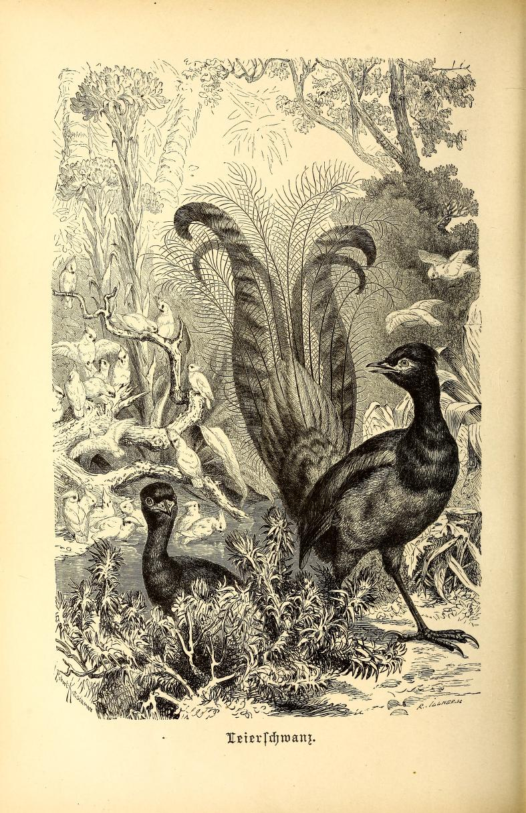

# Lyrebird: 3D Molecular Conformer Generation

<p align="left">

</p>

This repository contains the **Lyrebird** neural network for 3D conformer generation, developed by Rowan based on the [ETFlow](https://arxiv.org/abs/2410.22388v1) architecture, and a Butina cluster-based train/val/test split of the [GEOM](https://doi.org/10.1038/s41597-022-01288-4) dataset and [CREMP](https://doi.org/10.1038/s41597-024-03698-y).

This work was completed by Vedanth Nilabh during an internship at [Rowan](https://rowansci.com/). For questions or issues, please open a GitHub issue or contact nilabh.v@northeastern.edu.

## Overview

Lyrebird is trained on diverse molecular geometries from the [GEOM](https://doi.org/10.1038/s41597-022-01288-4) datasets (DRUGS and QM9), as well as [CREMP](https://doi.org/10.1038/s41597-024-03698-y), and generates 3D molecular conformers from SMILES strings using an equivariant flow-based generative model.
We also have detailed energy benchmark results (which measures energy differences pre and post optimization with groynd truth and optimizes structures using the semi-empirical method GNF2-XTB) in the associated folder, along with a detailed description of the motivation and methodology. 

For the newly released MPCONF-196-GEN bechmark see: [MPCONF-196-GEN-benchmark](https://github.com/rowansci/MPCONF196GEN-benchmark)
## Example Usage

```python
import torch
from lyrebird import LyrebirdCalculator

# Initialize the calculator
device = torch.device("cuda" if torch.cuda.is_available() else "cpu")
calculator = LyrebirdCalculator("lyrebird.yaml", "lyrebird.ckpt", device=device)

# Generate conformers from SMILES
smiles = "CC(C)CC1=CC=C(C=C1)C(C)C(=O)O"  # ibuprofen
conformers = calculator.predict(smiles, num_initial_confs=5)

print(f"Generated {len(conformers)} conformers")
print(f"First conformer shape: {conformers[0].shape}")  # (N_atoms, 3)
```

## Local Usage

Install the required packages using:
```bash
conda env create -f environment.yml
conda activate lyrebird-env
```

To run the example script:
```bash
python example.py
```

This model can run on either CPU or GPU. GPU is recommended for faster generation of multiple conformers.

## License

This model is released under the MIT License. See [LICENSE](LICENSE) for details.

